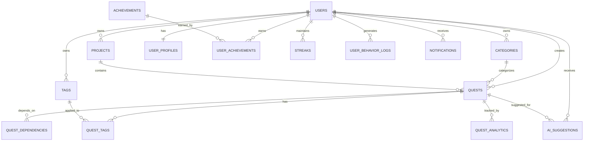

# Database Design

## Overview

Questlog uses PostgreSQL as the primary database with Redis for caching and session storage. The database design follows normalized relational principles while optimizing for the specific requirements of gamified task management and AI-powered features.

## Database Schema

### Core Tables

#### Users Table
```sql
CREATE TABLE users (
    id UUID PRIMARY KEY DEFAULT gen_random_uuid(),
    email VARCHAR(255) UNIQUE NOT NULL,
    username VARCHAR(50) UNIQUE NOT NULL,
    display_name VARCHAR(100),
    avatar_url TEXT,
    timezone VARCHAR(50) DEFAULT 'UTC',
    language VARCHAR(10) DEFAULT 'en',
    created_at TIMESTAMP WITH TIME ZONE DEFAULT NOW(),
    updated_at TIMESTAMP WITH TIME ZONE DEFAULT NOW(),
    last_login_at TIMESTAMP WITH TIME ZONE,
    is_active BOOLEAN DEFAULT true,
    subscription_tier VARCHAR(20) DEFAULT 'free' CHECK (subscription_tier IN ('free', 'premium', 'enterprise')),
    subscription_expires_at TIMESTAMP WITH TIME ZONE,
    email_verified BOOLEAN DEFAULT false,
    email_verification_token UUID,
    password_reset_token UUID,
    password_reset_expires_at TIMESTAMP WITH TIME ZONE,
    preferences JSONB DEFAULT '{}',
    metadata JSONB DEFAULT '{}'
);

-- Indexes
CREATE INDEX idx_users_email ON users(email);
CREATE INDEX idx_users_username ON users(username);
CREATE INDEX idx_users_subscription_tier ON users(subscription_tier);
CREATE INDEX idx_users_created_at ON users(created_at);
CREATE INDEX idx_users_last_login_at ON users(last_login_at);
```

#### Quests Table
```sql
CREATE TABLE quests (
    id UUID PRIMARY KEY DEFAULT gen_random_uuid(),
    user_id UUID NOT NULL REFERENCES users(id) ON DELETE CASCADE,
    title VARCHAR(255) NOT NULL,
    description TEXT,
    category_id UUID REFERENCES categories(id),
    project_id UUID REFERENCES projects(id),
    status VARCHAR(20) DEFAULT 'active' CHECK (status IN ('draft', 'active', 'in_progress', 'completed', 'paused', 'overdue', 'deleted')),
    priority INTEGER DEFAULT 0 CHECK (priority >= 0 AND priority <= 5),
    due_date TIMESTAMP WITH TIME ZONE,
    estimated_time_minutes INTEGER CHECK (estimated_time_minutes > 0),
    actual_time_minutes INTEGER DEFAULT 0 CHECK (actual_time_minutes >= 0),
    progress_percentage INTEGER DEFAULT 0 CHECK (progress_percentage >= 0 AND progress_percentage <= 100),
    complexity VARCHAR(20) DEFAULT 'simple' CHECK (complexity IN ('simple', 'moderate', 'complex', 'expert')),
    recurrence_pattern JSONB,
    parent_quest_id UUID REFERENCES quests(id),
    ai_priority_score DECIMAL(5,2),
    created_at TIMESTAMP WITH TIME ZONE DEFAULT NOW(),
    updated_at TIMESTAMP WITH TIME ZONE DEFAULT NOW(),
    completed_at TIMESTAMP WITH TIME ZONE,
    deleted_at TIMESTAMP WITH TIME ZONE,
    metadata JSONB DEFAULT '{}'
);

-- Indexes
CREATE INDEX idx_quests_user_id ON quests(user_id);
CREATE INDEX idx_quests_status ON quests(status);
CREATE INDEX idx_quests_category_id ON quests(category_id);
CREATE INDEX idx_quests_project_id ON quests(project_id);
CREATE INDEX idx_quests_due_date ON quests(due_date);
CREATE INDEX idx_quests_priority ON quests(priority);
CREATE INDEX idx_quests_parent_quest_id ON quests(parent_quest_id);
CREATE INDEX idx_quests_ai_priority_score ON quests(ai_priority_score);
CREATE INDEX idx_quests_created_at ON quests(created_at);
CREATE INDEX idx_quests_completed_at ON quests(completed_at);

-- Composite indexes for common queries
CREATE INDEX idx_quests_user_status ON quests(user_id, status);
CREATE INDEX idx_quests_user_due_date ON quests(user_id, due_date);
CREATE INDEX idx_quests_user_priority ON quests(user_id, priority);
CREATE INDEX idx_quests_status_due_date ON quests(status, due_date);
```

#### Categories Table
```sql
CREATE TABLE categories (
    id UUID PRIMARY KEY DEFAULT gen_random_uuid(),
    user_id UUID REFERENCES users(id) ON DELETE CASCADE,
    name VARCHAR(100) NOT NULL,
    color VARCHAR(7) DEFAULT '#2563EB',
    icon VARCHAR(50),
    is_default BOOLEAN DEFAULT false,
    sort_order INTEGER DEFAULT 0,
    created_at TIMESTAMP WITH TIME ZONE DEFAULT NOW(),
    updated_at TIMESTAMP WITH TIME ZONE DEFAULT NOW(),
    metadata JSONB DEFAULT '{}'
);

-- Indexes
CREATE INDEX idx_categories_user_id ON categories(user_id);
CREATE INDEX idx_categories_name ON categories(name);
CREATE INDEX idx_categories_sort_order ON categories(sort_order);
```

#### Projects Table
```sql
CREATE TABLE projects (
    id UUID PRIMARY KEY DEFAULT gen_random_uuid(),
    user_id UUID NOT NULL REFERENCES users(id) ON DELETE CASCADE,
    name VARCHAR(255) NOT NULL,
    description TEXT,
    status VARCHAR(20) DEFAULT 'active' CHECK (status IN ('active', 'completed', 'paused', 'archived')),
    start_date DATE,
    end_date DATE,
    progress_percentage INTEGER DEFAULT 0 CHECK (progress_percentage >= 0 AND progress_percentage <= 100),
    color VARCHAR(7) DEFAULT '#6B7280',
    icon VARCHAR(50),
    created_at TIMESTAMP WITH TIME ZONE DEFAULT NOW(),
    updated_at TIMESTAMP WITH TIME ZONE DEFAULT NOW(),
    metadata JSONB DEFAULT '{}'
);

-- Indexes
CREATE INDEX idx_projects_user_id ON projects(user_id);
CREATE INDEX idx_projects_status ON projects(status);
CREATE INDEX idx_projects_start_date ON projects(start_date);
CREATE INDEX idx_projects_end_date ON projects(end_date);
```

#### Tags Table
```sql
CREATE TABLE tags (
    id UUID PRIMARY KEY DEFAULT gen_random_uuid(),
    user_id UUID NOT NULL REFERENCES users(id) ON DELETE CASCADE,
    name VARCHAR(50) NOT NULL,
    color VARCHAR(7) DEFAULT '#6B7280',
    created_at TIMESTAMP WITH TIME ZONE DEFAULT NOW(),
    metadata JSONB DEFAULT '{}'
);

-- Indexes
CREATE INDEX idx_tags_user_id ON tags(user_id);
CREATE INDEX idx_tags_name ON tags(name);
```

#### Quest Tags Table (Many-to-Many)
```sql
CREATE TABLE quest_tags (
    quest_id UUID NOT NULL REFERENCES quests(id) ON DELETE CASCADE,
    tag_id UUID NOT NULL REFERENCES tags(id) ON DELETE CASCADE,
    created_at TIMESTAMP WITH TIME ZONE DEFAULT NOW(),
    PRIMARY KEY (quest_id, tag_id)
);

-- Indexes
CREATE INDEX idx_quest_tags_quest_id ON quest_tags(quest_id);
CREATE INDEX idx_quest_tags_tag_id ON quest_tags(tag_id);
```

#### Quest Dependencies Table
```sql
CREATE TABLE quest_dependencies (
    id UUID PRIMARY KEY DEFAULT gen_random_uuid(),
    dependent_quest_id UUID NOT NULL REFERENCES quests(id) ON DELETE CASCADE,
    prerequisite_quest_id UUID NOT NULL REFERENCES quests(id) ON DELETE CASCADE,
    dependency_type VARCHAR(20) DEFAULT 'sequential' CHECK (dependency_type IN ('sequential', 'resource', 'time')),
    created_at TIMESTAMP WITH TIME ZONE DEFAULT NOW(),
    UNIQUE(dependent_quest_id, prerequisite_quest_id)
);

-- Indexes
CREATE INDEX idx_quest_dependencies_dependent ON quest_dependencies(dependent_quest_id);
CREATE INDEX idx_quest_dependencies_prerequisite ON quest_dependencies(prerequisite_quest_id);
CREATE INDEX idx_quest_dependencies_type ON quest_dependencies(dependency_type);
```

### Gamification Tables

#### User Profiles Table
```sql
CREATE TABLE user_profiles (
    id UUID PRIMARY KEY DEFAULT gen_random_uuid(),
    user_id UUID NOT NULL REFERENCES users(id) ON DELETE CASCADE,
    level INTEGER DEFAULT 1 CHECK (level > 0),
    experience_points INTEGER DEFAULT 0 CHECK (experience_points >= 0),
    total_quests_completed INTEGER DEFAULT 0 CHECK (total_quests_completed >= 0),
    current_streak_days INTEGER DEFAULT 0 CHECK (current_streak_days >= 0),
    longest_streak_days INTEGER DEFAULT 0 CHECK (longest_streak_days >= 0),
    total_streak_days INTEGER DEFAULT 0 CHECK (total_streak_days >= 0),
    total_time_spent_minutes INTEGER DEFAULT 0 CHECK (total_time_spent_minutes >= 0),
    average_completion_time_minutes DECIMAL(8,2) DEFAULT 0,
    created_at TIMESTAMP WITH TIME ZONE DEFAULT NOW(),
    updated_at TIMESTAMP WITH TIME ZONE DEFAULT NOW(),
    metadata JSONB DEFAULT '{}'
);

-- Indexes
CREATE INDEX idx_user_profiles_user_id ON user_profiles(user_id);
CREATE INDEX idx_user_profiles_level ON user_profiles(level);
CREATE INDEX idx_user_profiles_experience_points ON user_profiles(experience_points);
```

#### Achievements Table
```sql
CREATE TABLE achievements (
    id UUID PRIMARY KEY DEFAULT gen_random_uuid(),
    name VARCHAR(100) NOT NULL,
    description TEXT NOT NULL,
    category VARCHAR(50) NOT NULL,
    rarity VARCHAR(20) DEFAULT 'common' CHECK (rarity IN ('common', 'rare', 'epic', 'legendary')),
    icon VARCHAR(100),
    xp_reward INTEGER DEFAULT 0 CHECK (xp_reward >= 0),
    unlock_criteria JSONB NOT NULL,
    is_hidden BOOLEAN DEFAULT false,
    is_seasonal BOOLEAN DEFAULT false,
    seasonal_start_date DATE,
    seasonal_end_date DATE,
    created_at TIMESTAMP WITH TIME ZONE DEFAULT NOW(),
    metadata JSONB DEFAULT '{}'
);

-- Indexes
CREATE INDEX idx_achievements_category ON achievements(category);
CREATE INDEX idx_achievements_rarity ON achievements(rarity);
CREATE INDEX idx_achievements_is_hidden ON achievements(is_hidden);
CREATE INDEX idx_achievements_is_seasonal ON achievements(is_seasonal);
```

#### User Achievements Table
```sql
CREATE TABLE user_achievements (
    id UUID PRIMARY KEY DEFAULT gen_random_uuid(),
    user_id UUID NOT NULL REFERENCES users(id) ON DELETE CASCADE,
    achievement_id UUID NOT NULL REFERENCES achievements(id) ON DELETE CASCADE,
    unlocked_at TIMESTAMP WITH TIME ZONE DEFAULT NOW(),
    progress_data JSONB DEFAULT '{}',
    UNIQUE(user_id, achievement_id)
);

-- Indexes
CREATE INDEX idx_user_achievements_user_id ON user_achievements(user_id);
CREATE INDEX idx_user_achievements_achievement_id ON user_achievements(achievement_id);
CREATE INDEX idx_user_achievements_unlocked_at ON user_achievements(unlocked_at);
```

#### Streaks Table
```sql
CREATE TABLE streaks (
    id UUID PRIMARY KEY DEFAULT gen_random_uuid(),
    user_id UUID NOT NULL REFERENCES users(id) ON DELETE CASCADE,
    streak_type VARCHAR(20) NOT NULL CHECK (streak_type IN ('daily', 'weekly', 'monthly')),
    current_count INTEGER DEFAULT 0 CHECK (current_count >= 0),
    longest_count INTEGER DEFAULT 0 CHECK (longest_count >= 0),
    start_date DATE NOT NULL,
    last_activity_date DATE NOT NULL,
    is_active BOOLEAN DEFAULT true,
    created_at TIMESTAMP WITH TIME ZONE DEFAULT NOW(),
    updated_at TIMESTAMP WITH TIME ZONE DEFAULT NOW(),
    metadata JSONB DEFAULT '{}'
);

-- Indexes
CREATE INDEX idx_streaks_user_id ON streaks(user_id);
CREATE INDEX idx_streaks_type ON streaks(streak_type);
CREATE INDEX idx_streaks_is_active ON streaks(is_active);
CREATE INDEX idx_streaks_last_activity_date ON streaks(last_activity_date);
```

### AI and Analytics Tables

#### User Behavior Logs Table
```sql
CREATE TABLE user_behavior_logs (
    id UUID PRIMARY KEY DEFAULT gen_random_uuid(),
    user_id UUID NOT NULL REFERENCES users(id) ON DELETE CASCADE,
    action_type VARCHAR(50) NOT NULL,
    action_data JSONB,
    context_data JSONB,
    timestamp TIMESTAMP WITH TIME ZONE DEFAULT NOW(),
    session_id UUID,
    device_info JSONB,
    metadata JSONB DEFAULT '{}'
);

-- Indexes
CREATE INDEX idx_user_behavior_logs_user_id ON user_behavior_logs(user_id);
CREATE INDEX idx_user_behavior_logs_action_type ON user_behavior_logs(action_type);
CREATE INDEX idx_user_behavior_logs_timestamp ON user_behavior_logs(timestamp);
CREATE INDEX idx_user_behavior_logs_session_id ON user_behavior_logs(session_id);

-- Partition by month for performance
CREATE TABLE user_behavior_logs_2024_01 PARTITION OF user_behavior_logs
FOR VALUES FROM ('2024-01-01') TO ('2024-02-01');
```

#### AI Suggestions Table
```sql
CREATE TABLE ai_suggestions (
    id UUID PRIMARY KEY DEFAULT gen_random_uuid(),
    user_id UUID NOT NULL REFERENCES users(id) ON DELETE CASCADE,
    quest_id UUID REFERENCES quests(id) ON DELETE CASCADE,
    suggestion_type VARCHAR(50) NOT NULL,
    suggestion_data JSONB NOT NULL,
    confidence_score DECIMAL(3,2) CHECK (confidence_score >= 0 AND confidence_score <= 1),
    was_accepted BOOLEAN,
    created_at TIMESTAMP WITH TIME ZONE DEFAULT NOW(),
    expires_at TIMESTAMP WITH TIME ZONE,
    metadata JSONB DEFAULT '{}'
);

-- Indexes
CREATE INDEX idx_ai_suggestions_user_id ON ai_suggestions(user_id);
CREATE INDEX idx_ai_suggestions_quest_id ON ai_suggestions(quest_id);
CREATE INDEX idx_ai_suggestions_type ON ai_suggestions(suggestion_type);
CREATE INDEX idx_ai_suggestions_created_at ON ai_suggestions(created_at);
CREATE INDEX idx_ai_suggestions_expires_at ON ai_suggestions(expires_at);
```

#### Quest Analytics Table
```sql
CREATE TABLE quest_analytics (
    id UUID PRIMARY KEY DEFAULT gen_random_uuid(),
    quest_id UUID NOT NULL REFERENCES quests(id) ON DELETE CASCADE,
    user_id UUID NOT NULL REFERENCES users(id) ON DELETE CASCADE,
    time_spent_minutes INTEGER DEFAULT 0,
    completion_rate DECIMAL(5,2),
    difficulty_rating INTEGER CHECK (difficulty_rating >= 1 AND difficulty_rating <= 5),
    satisfaction_rating INTEGER CHECK (satisfaction_rating >= 1 AND satisfaction_rating <= 5),
    created_at TIMESTAMP WITH TIME ZONE DEFAULT NOW(),
    updated_at TIMESTAMP WITH TIME ZONE DEFAULT NOW(),
    metadata JSONB DEFAULT '{}'
);

-- Indexes
CREATE INDEX idx_quest_analytics_quest_id ON quest_analytics(quest_id);
CREATE INDEX idx_quest_analytics_user_id ON quest_analytics(user_id);
CREATE INDEX idx_quest_analytics_completion_rate ON quest_analytics(completion_rate);
```

### Notification Tables

#### Notifications Table
```sql
CREATE TABLE notifications (
    id UUID PRIMARY KEY DEFAULT gen_random_uuid(),
    user_id UUID NOT NULL REFERENCES users(id) ON DELETE CASCADE,
    type VARCHAR(50) NOT NULL,
    title VARCHAR(255) NOT NULL,
    message TEXT,
    data JSONB DEFAULT '{}',
    is_read BOOLEAN DEFAULT false,
    is_sent BOOLEAN DEFAULT false,
    sent_at TIMESTAMP WITH TIME ZONE,
    created_at TIMESTAMP WITH TIME ZONE DEFAULT NOW(),
    expires_at TIMESTAMP WITH TIME ZONE,
    metadata JSONB DEFAULT '{}'
);

-- Indexes
CREATE INDEX idx_notifications_user_id ON notifications(user_id);
CREATE INDEX idx_notifications_type ON notifications(type);
CREATE INDEX idx_notifications_is_read ON notifications(is_read);
CREATE INDEX idx_notifications_is_sent ON notifications(is_sent);
CREATE INDEX idx_notifications_created_at ON notifications(created_at);
```

#### Notification Preferences Table
```sql
CREATE TABLE notification_preferences (
    id UUID PRIMARY KEY DEFAULT gen_random_uuid(),
    user_id UUID NOT NULL REFERENCES users(id) ON DELETE CASCADE,
    notification_type VARCHAR(50) NOT NULL,
    email_enabled BOOLEAN DEFAULT true,
    push_enabled BOOLEAN DEFAULT true,
    in_app_enabled BOOLEAN DEFAULT true,
    created_at TIMESTAMP WITH TIME ZONE DEFAULT NOW(),
    updated_at TIMESTAMP WITH TIME ZONE DEFAULT NOW(),
    UNIQUE(user_id, notification_type)
);

-- Indexes
CREATE INDEX idx_notification_preferences_user_id ON notification_preferences(user_id);
CREATE INDEX idx_notification_preferences_type ON notification_preferences(notification_type);
```

## Database Relationships

### Entity Relationship Diagram



## Indexing Strategy

### Primary Indexes
- **Primary Keys**: All tables use UUID primary keys with gen_random_uuid()
- **Foreign Keys**: Indexed for join performance
- **Unique Constraints**: Email, username, composite unique constraints

### Performance Indexes
- **Query Optimization**: Indexes on frequently queried columns
- **Composite Indexes**: Multi-column indexes for complex queries
- **Partial Indexes**: Indexes on filtered data (e.g., active quests only)

### Specialized Indexes
- **Full-Text Search**: GIN indexes on text search columns
- **JSONB Indexes**: GIN indexes on JSONB columns for efficient querying
- **Time-Based**: Indexes on timestamp columns for time-range queries

## Data Partitioning

### Partitioning Strategy
- **User Behavior Logs**: Partitioned by month for performance
- **Notifications**: Partitioned by user_id for scalability
- **Analytics Data**: Partitioned by date for historical data management

### Partition Examples
```sql
-- Monthly partitioning for behavior logs
CREATE TABLE user_behavior_logs_2024_01 PARTITION OF user_behavior_logs
FOR VALUES FROM ('2024-01-01') TO ('2024-02-01');

-- User-based partitioning for notifications
CREATE TABLE notifications_user_1 PARTITION OF notifications
FOR VALUES WITH (modulus 100, remainder 1);
```

## Data Retention and Archival

### Retention Policies
- **User Behavior Logs**: 12 months retention, then archival
- **Notifications**: 6 months retention, then deletion
- **Quest Analytics**: 24 months retention, then archival
- **AI Suggestions**: 3 months retention, then deletion

### Archival Strategy
- **Cold Storage**: Archived data moved to S3
- **Compression**: Data compressed before archival
- **Restoration**: Automated restoration process for archived data

## Backup and Recovery

### Backup Strategy
- **Full Backups**: Daily full database backups
- **Incremental Backups**: Hourly incremental backups
- **Point-in-Time Recovery**: 30-day point-in-time recovery window
- **Cross-Region**: Backups replicated to secondary region

### Recovery Procedures
- **RTO**: 4 hours recovery time objective
- **RPO**: 1 hour recovery point objective
- **Testing**: Monthly disaster recovery testing
- **Documentation**: Detailed recovery runbooks

## Performance Optimization

### Query Optimization
- **Query Analysis**: Regular query performance analysis
- **Index Tuning**: Continuous index optimization
- **Query Rewriting**: Optimize slow queries
- **Connection Pooling**: Efficient connection management

### Caching Strategy
- **Application Cache**: Redis for frequently accessed data
- **Query Cache**: Cache expensive query results
- **Session Cache**: User session data in Redis
- **CDN Cache**: Static assets cached globally

### Monitoring and Alerting
- **Performance Metrics**: Query execution time monitoring
- **Resource Usage**: CPU, memory, disk I/O monitoring
- **Connection Pool**: Connection pool health monitoring
- **Slow Queries**: Alert on slow query detection

## Security Considerations

### Data Encryption
- **At Rest**: AES-256 encryption for all data
- **In Transit**: TLS 1.3 for all connections
- **Backup Encryption**: Encrypted backups
- **Key Management**: AWS KMS for key management

### Access Control
- **Row-Level Security**: User data isolation
- **Connection Security**: SSL/TLS required
- **Audit Logging**: All database access logged
- **Privilege Management**: Minimal required privileges

### Data Privacy
- **PII Handling**: Personal data anonymization
- **GDPR Compliance**: Right to be forgotten
- **Data Classification**: Sensitive data identification
- **Access Logging**: Audit trail for data access 