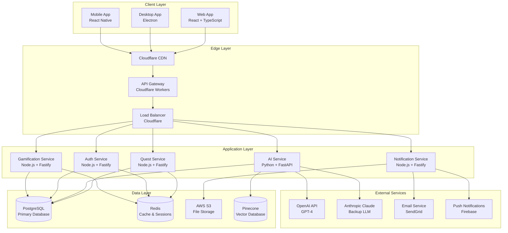

# System Architecture

## Overview

Questlog is built as a modern, scalable microservices architecture designed to support gamified task management with AI-powered prioritization. The system is designed for high availability, real-time synchronization, and seamless cross-platform experiences.

## High-Level Architecture



## Service Architecture

### Core Services

#### 1. Quest Service
**Technology Stack**: Node.js 18+, Fastify, Prisma, TypeScript
**Purpose**: Manages all quest-related operations and business logic

**Key Responsibilities**:
- Quest CRUD operations
- Quest state management
- Progress tracking
- Quest relationships and dependencies
- Quest templates and categories
- File attachments and media

**Key Endpoints**:
```
POST   /api/v1/quests                    # Create quest
GET    /api/v1/quests                    # List quests with filters
GET    /api/v1/quests/:id                # Get quest details
PUT    /api/v1/quests/:id                # Update quest
DELETE /api/v1/quests/:id                # Delete quest
POST   /api/v1/quests/:id/complete       # Mark quest complete
POST   /api/v1/quests/:id/progress       # Update progress
GET    /api/v1/quests/:id/dependencies   # Get quest dependencies
POST   /api/v1/quests/:id/dependencies   # Add dependency
```

**Data Models**:
- Quest (core entity)
- QuestDependency (relationships)
- QuestAttachment (files)
- QuestTemplate (reusable patterns)

#### 2. AI Service
**Technology Stack**: Python 3.11+, FastAPI, PyTorch, Transformers
**Purpose**: Provides intelligent task prioritization and AI-powered features

**Key Responsibilities**:
- Quest prioritization algorithms
- User behavior analysis
- Smart suggestions and recommendations
- Natural language processing
- Context-aware task breakdown
- Pattern recognition and learning

**Key Endpoints**:
```
POST   /api/v1/ai/prioritize             # Get prioritized quest list
POST   /api/v1/ai/suggest                # Get AI suggestions
POST   /api/v1/ai/analyze                # Analyze user patterns
POST   /api/v1/ai/breakdown              # Break down complex tasks
POST   /api/v1/ai/classify               # Classify quest content
GET    /api/v1/ai/insights               # Get user insights
```

**AI Models**:
- Priority Scoring Model (custom)
- Context Understanding Model (custom)
- Pattern Recognition Model (custom)
- LLM Integration (OpenAI GPT-4, Claude)

#### 3. Authentication Service
**Technology Stack**: Node.js 18+, Fastify, JWT, OAuth2
**Purpose**: Handles user authentication, authorization, and session management

**Key Responsibilities**:
- User registration and login
- Password management and security
- OAuth integration (Google, GitHub, etc.)
- Session management and JWT tokens
- Role-based access control (RBAC)
- Account recovery and security

**Key Endpoints**:
```
POST   /api/v1/auth/register             # User registration
POST   /api/v1/auth/login                # User login
POST   /api/v1/auth/refresh              # Refresh token
POST   /api/v1/auth/logout               # User logout
POST   /api/v1/auth/forgot-password      # Password recovery
POST   /api/v1/auth/reset-password       # Reset password
GET    /api/v1/auth/profile              # Get user profile
PUT    /api/v1/auth/profile              # Update profile
```

**Security Features**:
- JWT with refresh token rotation
- Password hashing (bcrypt)
- Rate limiting and brute force protection
- Multi-factor authentication (future)
- Session invalidation

#### 4. Gamification Service
**Technology Stack**: Node.js 18+, Fastify, Redis, TypeScript
**Purpose**: Manages achievements, levels, experience points, and rewards

**Key Responsibilities**:
- Experience point calculation and tracking
- Achievement system management
- Level progression and benefits
- Streak tracking and maintenance
- Leaderboards and social features
- Reward distribution and notifications

**Key Endpoints**:
```
GET    /api/v1/gamification/profile      # Get user profile
GET    /api/v1/gamification/achievements # Get achievements
POST   /api/v1/gamification/award        # Award XP/achievements
GET    /api/v1/gamification/leaderboard  # Get leaderboard
GET    /api/v1/gamification/streaks      # Get streak data
POST   /api/v1/gamification/streaks      # Update streaks
```

**Gamification Features**:
- XP calculation with dynamic multipliers
- Achievement unlocking and progress tracking
- Level-based feature unlocks
- Streak bonuses and penalties
- Social leaderboards and sharing

#### 5. Notification Service
**Technology Stack**: Node.js 18+, Fastify, Redis, Queue System
**Purpose**: Manages all notification delivery and scheduling

**Key Responsibilities**:
- Email notification delivery
- Push notification management
- In-app notification storage
- Notification scheduling and queuing
- Notification preferences and opt-outs
- Delivery tracking and analytics

**Key Endpoints**:
```
POST   /api/v1/notifications/send        # Send notification
POST   /api/v1/notifications/schedule    # Schedule notification
GET    /api/v1/notifications/history     # Get notification history
PUT    /api/v1/notifications/preferences # Update preferences
POST   /api/v1/notifications/mark-read   # Mark as read
```

**Notification Types**:
- Quest reminders and deadlines
- Achievement unlocks and celebrations
- Streak maintenance alerts
- AI suggestions and insights
- System announcements and updates

### Supporting Services

#### Analytics Service
- User behavior tracking
- Performance metrics collection
- A/B testing support
- Data export and reporting

#### Integration Service
- Third-party app integrations
- Calendar synchronization
- File storage sync
- Webhook management

#### Search Service
- Full-text quest search
- Advanced filtering
- Search suggestions
- Search analytics

## Data Architecture

### Database Strategy

#### Primary Database (PostgreSQL)
- **Purpose**: Primary data storage for all business entities
- **Schema**: Normalized relational design
- **Features**: ACID compliance, complex queries, transactions
- **Scaling**: Read replicas, connection pooling

#### Cache Layer (Redis)
- **Purpose**: Session storage, quest caching, rate limiting
- **Features**: In-memory performance, pub/sub, data structures
- **Scaling**: Redis Cluster for high availability

#### Vector Database (Pinecone)
- **Purpose**: AI embeddings and similarity search
- **Features**: High-dimensional vector storage
- **Use Cases**: Quest similarity, content recommendations

#### File Storage (AWS S3)
- **Purpose**: User uploads, assets, backups
- **Features**: Global CDN, versioning, lifecycle policies
- **Security**: Encrypted at rest and in transit

### Data Flow Patterns

#### Write-Through Pattern
- All writes go to primary database
- Cache updated synchronously
- Ensures data consistency

#### Read-Aside Pattern
- Check cache first for reads
- Fall back to database if cache miss
- Populate cache on database reads

#### Event-Driven Updates
- Database changes trigger events
- Services subscribe to relevant events
- Asynchronous cache invalidation

## Security Architecture

### Authentication & Authorization
- JWT-based stateless authentication
- Role-based access control (RBAC)
- API key management for integrations
- Session management with Redis

### Data Protection
- Encryption at rest (AES-256)
- Encryption in transit (TLS 1.3)
- PII data anonymization
- GDPR compliance measures

### API Security
- Rate limiting and throttling
- Input validation and sanitization
- CORS policy enforcement
- Security headers (Helmet.js)

## Scalability Strategy

### Horizontal Scaling
- Stateless service design
- Load balancer distribution
- Database read replicas
- Cache clustering

### Performance Optimization
- Database query optimization
- Caching strategies
- CDN for static assets
- API response compression

### Monitoring & Observability
- Application performance monitoring (APM)
- Distributed tracing
- Centralized logging
- Health checks and alerting

## Deployment Architecture

### Environment Strategy
- **Development**: Local Docker Compose
- **Staging**: AWS ECS with staging database
- **Production**: AWS ECS with production database
- **Testing**: Isolated test environments

### Infrastructure as Code
- Terraform for infrastructure provisioning
- Docker for containerization
- Kubernetes for orchestration (future)
- GitHub Actions for CI/CD

### Disaster Recovery
- Database backups and point-in-time recovery
- Multi-region deployment strategy
- Automated failover procedures
- Data retention and archival policies 